# Cat-Scan


[](https://gitee.com/jenbrannstrom/rtbcat-platform/stargazers)
[](https://gitee.com/jenbrannstrom/rtbcat-platform/members)

[English](README-en.md)

Cat-Scan 是一个适用于 Google Authorized Buyers 的 QPS 控制平面。

它不会取代您的竞价器。它能让竞价器和操作员更清晰地了解当前状况，并帮助调整 Google 实际暴露的可用杠杆：预定位配置、席位级流量组合、广告素材规范以及报表。

Google 自身已经在它的侧做了很多减少浪费的工作，这是事实。Cat-Scan 的存在是为了处理您在自己这一侧仍能控制的最后一层问题。

目前的功能：
- 通过 Gmail 或手动上传导入 Google Authorized Buyers 的 CSV 报表
- 从 Authorized Buyers API 同步广告素材、席位、端点和预定位数据
- 展示按预定位配置、QPS、竞价流、媒体、地域、尺寸划分的浪费信号
- 根据目标地址模式将广告素材分组为广告活动
- 推荐并应用预定位更改，支持回滚和审计历史
- 支持多席位操作，具有用户角色和按席位划分的访问权限

目前不包含的功能：
- 尚无足够的公开部署数据来声称典型的改进百分比
- 如果没有外部转化数据，无法获知广告主价值或生命周期价值
- 不会取代竞价器端的逻辑；它是竞价器的补充

## 问题一图概览


## 为何存在

Authorized Buyers 为您提供了大量流量，但只有有限的控制手段。

竞价器看到的是它接收到的数据洪流。Google 看到的是它自己一方的交易平台状况。这两方都无法为您提供一个清晰的控制面板，来了解 QPS 浪费在哪里、支出实际集中在何处、或者哪些预定位配置带来了无效负担。

Cat-Scan 填补了这一空白。

当前的优化器逻辑特意保持简单：
- 跟踪竞价
- 跟踪支出
- 削减无效负担
- 在真正接入前，将点击后数据视为缺失的信号

该逻辑在 [docs/OPTIMIZATION_LOGIC.md](docs/OPTIMIZATION_LOGIC.md) 中有描述。

## 当前范围

### 已构建并可用

- 通过 Gmail 和手动方式导入五种核心的 Authorized Buyers 报表类型
- 从 Authorized Buyers 同步广告素材
- 按媒体、地域和尺寸进行 QPS 分析
- 配置和广告活动视图
- 预定位建议、应用流程、回滚和审计跟踪
- 导入历史、数据新鲜度和保留控制
- 具有按席位划分的访问权限的多用户认证
- 基于目标 URL 和广告素材元数据的广告活动聚类
- 点击宏审计和 AppsFlyer 就绪性诊断

### 已构建但为可选的 AI 功能

- 广告素材模态框中的 AI 辅助语言检测和地域-语言不匹配分析
- 可选择的语言分析提供商（Gemini、Claude 或 Grok）
- 这些功能需要显式配置提供商，在生产部署中默认禁用

### 正在积极构建

- 转化数据接入和归因，首选 AppsFlyer
- 接入转化和价值数据后，使优化器决策更加强大

## 界面预览

### QPS 与效率一览

查看每个配置的已分配 QPS 与实际 QPS，以及整个席位的整体利用率。

<p float="left">
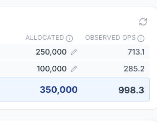
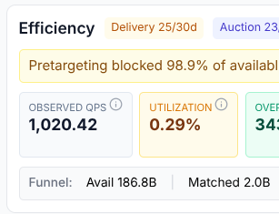
</p>

### 各配置的赢得率与浪费率

每个预定位配置都显示达到的查询量、赢得率和浪费百分比。可直接在此编辑 QPS 限制或暂停配置。

<p float="left">
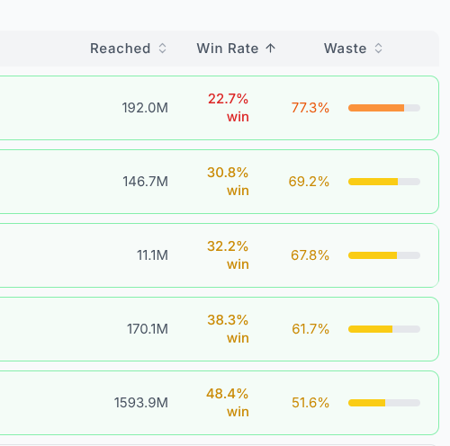
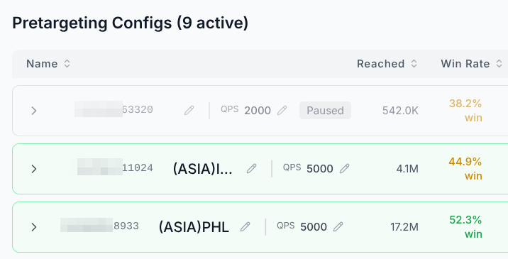
</p>

### 广告素材管理

按审核状态、支出层级和格式浏览已同步的广告素材。筛选出未通过的广告素材，找出阻碍信号的原因。

<p float="left">
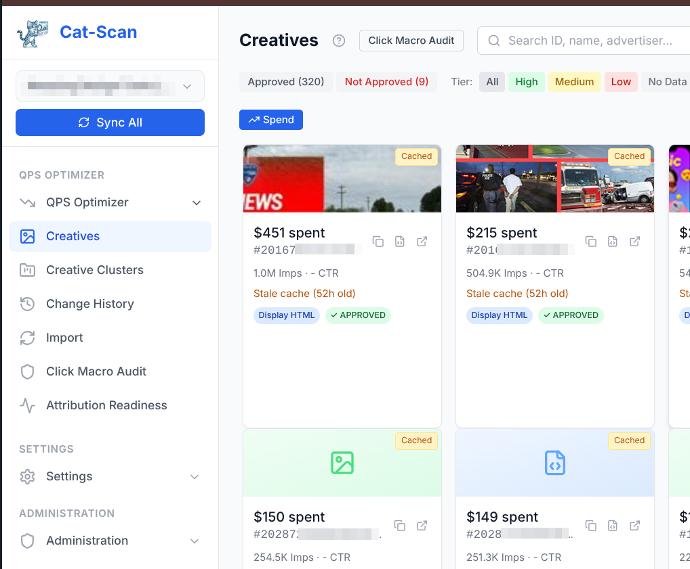
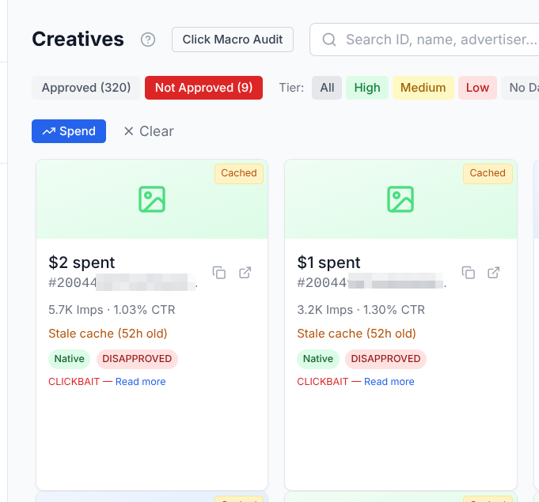
</p>

### 点击宏审计

Google 要求支持点击宏。此表显示哪些广告素材包含点击宏，哪些不包含。

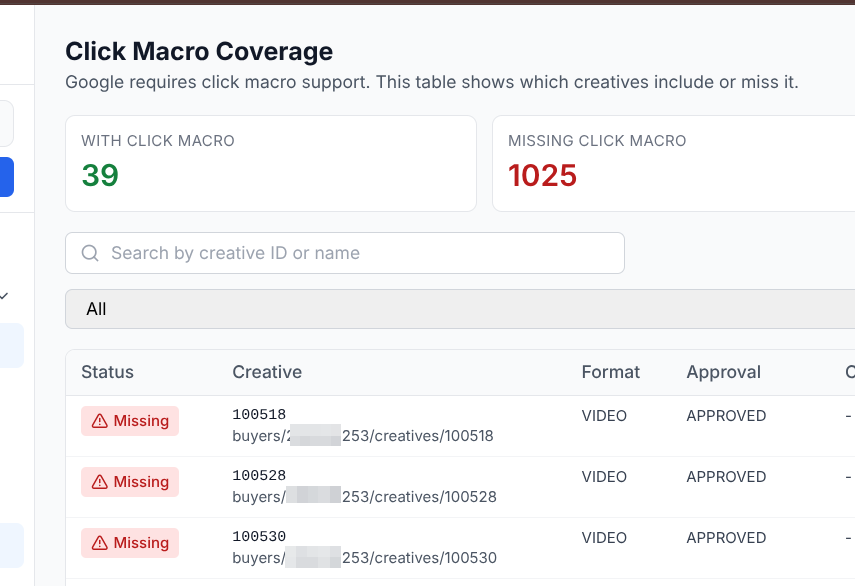

### 广告活动聚类

广告素材根据目标 URL 自动分组。这可以揭示哪些广告活动针对相同的受众，以及支出在哪里重叠。

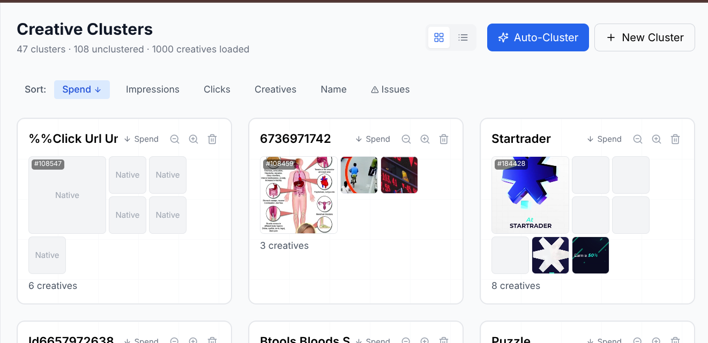

### 媒体屏蔽/允许

查看按支出、展示次数和赢得率排名的媒体。直接屏蔽表现不佳的媒体。

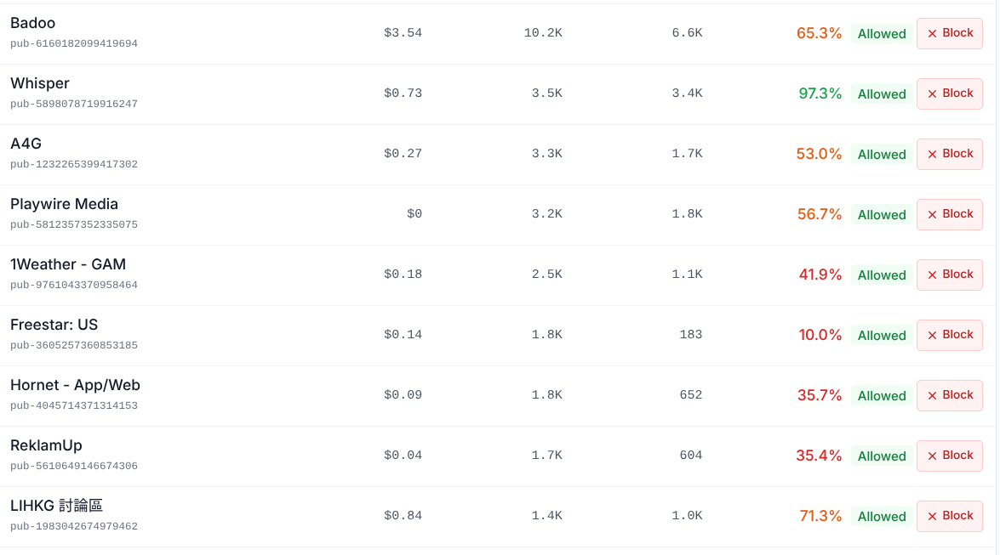

### 带确认的分阶段更改

您所做的更改会先被暂存。在您审核列表并点击"是，推送到 Google"之前，不会向 Google 发送任何内容。系统会自动创建快照，以便您在需要时回滚。

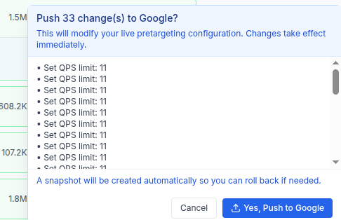

### 数据保留

控制原始数据和汇总数据的保留时长。自动汇总功能可压缩旧数据，同时不丢失趋势可见性。

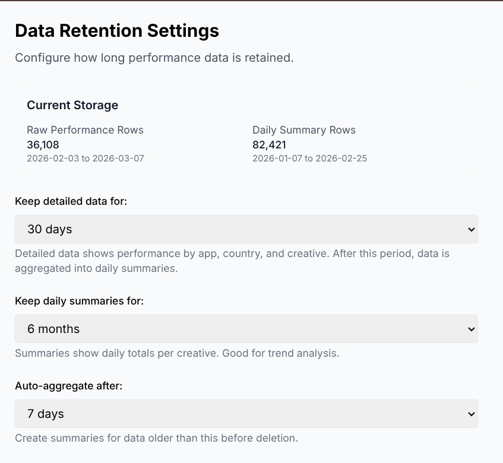

## 快速开始

```bash
git clone https://gitee.com/jenbrannstrom/rtbcat-platform.git
cd rtbcat-platform
cp .env.example .env
# 首先在 .env 中设置 POSTGRES_DSN 和 POSTGRES_SERVING_DSN
./setup.sh
./run.sh
```

打开 `http://localhost:3000`。

环境要求：
- Python 3.11+
- Node.js 18+
- Postgres 14+
- `ffmpeg` 可选，用于生成视频缩略图

`./setup.sh` 在初始化数据库模式之前，需要先配置好 Postgres 连接字符串。更多安装细节请参阅 [INSTALL.md](INSTALL.md)。

## 安装模式

安装过程有意分步进行。

1. 启动应用。
2. 添加 Gmail 导入。
3. 验证数据路径。
4. 仅在您真正想要实时更改预定位配置时，才添加 Google 写入权限。

这样，即使是全新安装也能发挥作用，而无需在第一天就强制使用高风险凭证。

身份验证和首个管理员引导流程在 [docs/AUTHENTICATION.md](docs/AUTHENTICATION.md) 中有详细说明。

## 主要路由

以下是操作员需要关注的主要路由。

| 功能区域 | 路由 | 目的 |
|---|---|---|
| 首页 | `/` | 顶级状态和摘要 |
| 初始设置 | `/setup` | 首次运行检查与引导 |
| 广告素材 | `/creatives` | 广告素材列表与审核 |
| 点击宏 | `/creatives/click-macros` | 点击宏审计 |
| 归因就绪性 | `/creatives/attribution-readiness` | 席位级 AppsFlyer 就绪性 |
| 广告活动 | `/campaigns` | 广告活动与聚类视图 |
| 导入 | `/import` | 手动上传、Gmail 状态、导入历史 |
| 历史记录 | `/history` | 更改和导入历史 |
| 按媒体划分的 QPS | `/qps/publisher` | 媒体侧的 QPS 与浪费 |
| 按地域划分的 QPS | `/qps/geo` | 地域侧的 QPS 与浪费 |
| 按尺寸划分的 QPS | `/qps/size` | 尺寸覆盖范围与浪费 |
| 浪费分析 | `/waste-analysis` | 浪费与低效分析 |
| 设置 | `/settings` | 主要设置入口 |
| 已关联账户 | `/settings/accounts` | Google API、Gmail 以及可选的 AI 提供商配置 |
| 数据保留 | `/settings/retention` | 保留控制 |
| 系统 | `/settings/system` | 运行时、数据库、缩略图、健康状态 |
| 管理后台 | `/admin` | 用户、配置、审计日志 |

同时，`/{buyerId}/...` 路径下也存在按买家范围划分的等效路由。

## 架构简述

前端使用 Next.js。后端使用 FastAPI。服务数据库是 Postgres。在 GCP 部署路径中，通过 `cloud-sql-proxy` 连接 Cloud SQL。原始数据导出和归档路径可以使用 GCS 和 BigQuery，但面向操作员的应用运行在 Postgres 之上。反向代理和身份验证取决于部署模式：本地/开发环境可以使用 Caddy，而 GCP 路径则需要外部的 Nginx 和 OAuth 代理配合。

完整的技术布局请参阅 [ARCHITECTURE.md](ARCHITECTURE.md)。

## 五种 CSV 报表

Cat-Scan 仍然依赖五种独立的 Authorized Buyers 报表，因为 Google 不允许在一次导出中组合所有必需的字段。

必需的报表：
1. `catscan-bidsinauction`
2. `catscan-quality`
3. `catscan-pipeline-geo`
4. `catscan-pipeline`
5. `catscan-bid-filtering`

为何需要五种：
- 竞价请求和预定位配置无法在同一份报表中获取
- 广告素材级别和媒体级别的视图也因不兼容的报表格式而分开

导入器将这些报表合并成一个可用的数据集。详情请参阅 [DATA_MODEL.md](DATA_MODEL.md) 和 [importers/README.md](importers/README.md)。

## API 接口

API 接口数量较多，无法在简短的 README 表格中完整列出。当前的路由器范围包括：
- 认证与引导
- 系统与健康检查
- 广告素材、实时广告素材获取、广告素材缓存
- 语言与地域语言分析
- 席位与席位管理
- 广告活动
- 设置与预定位流程
- 分析首页、浪费分析、流量、支出、RTB 竞价流和 QPS
- 上传、Gmail、数据保留、预计算、故障排查
- 转化与优化器路由
- 管理后台

在本地运行后，可使用 `http://localhost:8000/docs` 查看当前的 OpenAPI 接口文档。

## 部署

此仓库支持两种主要的部署模式。

### 本地或简单的自托管
- Next.js 运行在 `3000` 端口
- FastAPI 运行在 `8000` 端口
- 本地 Postgres 或外部 Postgres
- 可选的 Caddy 反向代理

### GCP 路径
- 前置外部反向代理和身份验证
- `cloud-sql-proxy` 边车容器
- FastAPI 容器
- Next.js 容器
- Cloud SQL 中的 Postgres 服务数据库
- 可选的用于原始数据和归档数据的 GCS / BigQuery 管道

从 [INSTALL.md](INSTALL.md) 开始。有关发布/构建规则，请使用 [docs/VERSIONING.md](docs/VERSIONING.md)。

## 文档

**[中文用户手册](manual/zh/index.md)** — 完整的中文使用指南，涵盖从入门到部署的所有内容。

| 文档 | 用途 |
|---|---|
| [用户手册](manual/zh/index.md) | 完整中文使用指南 |
| [什么是 Cat-Scan](manual/zh/00-what-is-cat-scan.md) | 产品介绍与核心概念 |
| [QPS 漏斗](manual/zh/03-qps-funnel.md) | 理解 QPS 浪费分析 |
| [浪费分析](manual/zh/04-analyzing-waste.md) | 如何分析和减少浪费 |
| [预定位管理](manual/zh/06-pretargeting.md) | 预定位配置管理 |
| [优化器](manual/zh/07-optimizer.md) | 优化器逻辑与使用 |
| [数据导入](manual/zh/09-data-import.md) | CSV 报表导入流程 |
| [部署](manual/zh/12-deployment.md) | 部署与运维 |
| [常见问题](manual/zh/faq.md) | FAQ |
| [术语表](manual/zh/glossary.md) | 术语中英对照 |
|---|---|
| [INSTALL.md](INSTALL.md) | 本地安装、生产环境安装、Gmail 设置 |
| [ARCHITECTURE.md](ARCHITECTURE.md) | 当前系统架构 |
| [DATA_MODEL.md](DATA_MODEL.md) | Postgres 模式与导入模型 |
| [ROADMAP.md](ROADMAP.md) | 已完成、部分完成和未来计划的功能 |
| [CHANGELOG.md](CHANGELOG.md) | 发布历史 |
| [CONTRIBUTING.md](CONTRIBUTING.md) | 贡献流程 |

## 安全模型

规则很简单：
- 代码可以公开
- 数据和凭证不能公开

请务必保密：
- `.env` 文件
- 服务账号密钥
- Gmail 令牌
- Postgres 凭证
- `terraform.tfvars` 文件
- `~/.catscan/` 目录下的本地数据库、导入文件和缩略图

仓库的预检和密钥扫描都基于此假设设计。请参阅 [SECURITY.md](SECURITY.md)。

## 当前状态

发布工程状态良好。

截至 `v0.9.4` 版本：
- OSS 预检检查通过
- 此仓库中的完整 Python 测试套件通过
- 仪表板构建和代码检查通过

仍需更多验证的方面：
- 在多个真实部署中，可衡量的效率提升
- 在生产规模下，端到端的、由转化数据驱动的优化
- 与提供商无关的语言分析，而非单一的、可选的 AI 路径

## 贡献

在提交更改前，请运行基础检查：

```bash
./venv/bin/ruff check .
./venv/bin/pytest -q
cd dashboard && npm run lint && npm run build
```

其余内容请参阅 [CONTRIBUTING.md](CONTRIBUTING.md)。

## 联系方式

项目官网：[rtb.cat](https://rtb.cat)

问题和功能请求：[Gitee Issues](https://gitee.com/jenbrannstrom/rtbcat-platform/issues) | [GitHub Issues](https://github.com/jenbrannstrom/rtbcat-platform/issues)

微信：jenbrannstrom

LinkedIn：[jenbrannstrom](https://www.linkedin.com/in/jenbrannstrom)

## 许可证

MIT。参见 [LICENSE](LICENSE)。
