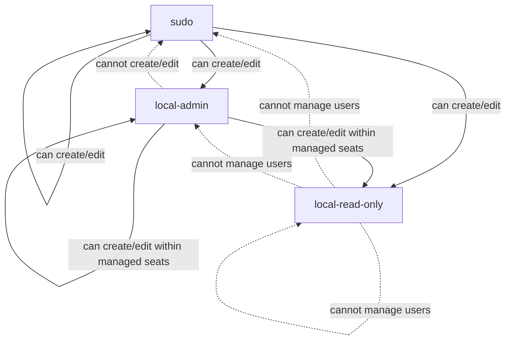
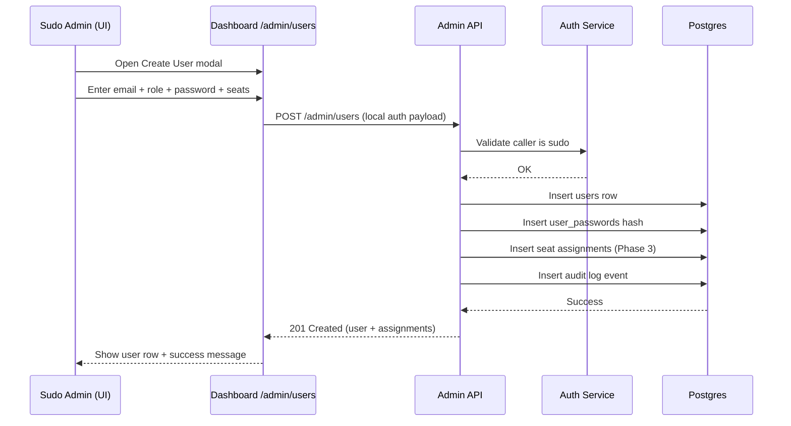
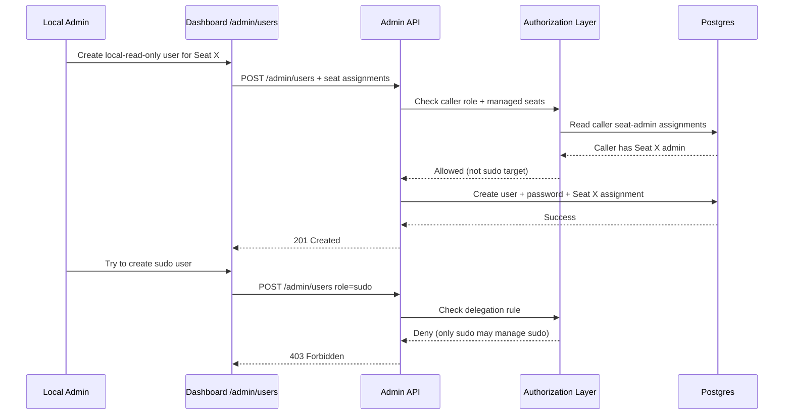
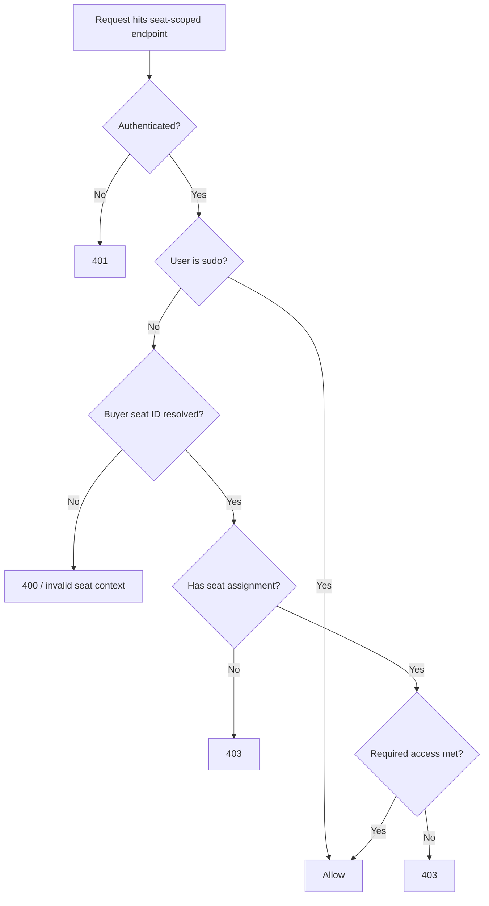

# User Management Audit and Plan (2026-02-22)

## Goal

Audit the current user-management implementation for:
- New-admin installation/onboarding success
- Multi-user usability and operability
- Seat assignment and authorization model

Then define a concrete plan for the requested model:
- `sudo`
- `local-admin`
- `local-read-only`
- Explicit seat assignment
- Local username/password user creation in admin UI/API

## Executive Summary

Current user management is functional but only partially aligned with the desired operating model.

What works today:
- First-admin bootstrap with token gating exists and is tested.
- Password auth exists and is usable.
- Admin UI exists for listing users, deactivating users, and assigning access.
- Access restrictions already apply to many seat-scoped routes.

Main gaps:
- Roles are only `admin` / `user` (no `sudo`, no seat-scoped admin role).
- Access is assigned indirectly via **service accounts**, not explicit buyer seats.
- Admin UI creates OAuth-style users (no password field), which is not aligned with a "local user/pass first" workflow.
- Delegation rules (only sudo can manage sudo; local-admin can manage local-admin/read-only) do not exist.
- Install/onboarding path is spread across bootstrap docs, auth flags, and multiple auth providers (more flexible, but harder for new admins).

## Current State Audit

### 1. Data Model (Current)

Current auth/user schema supports:
- `users` table with role constrained to `admin` or `user`
- `user_sessions`
- `user_passwords`
- `user_service_account_permissions`

Implications:
- Password auth is already implemented in the database.
- Seat-level assignment is **not** first-class.
- Authorization for non-admin users is derived by:
  1. user -> service account permission(s)
  2. service account -> buyer seat(s)

This is indirect and can over-grant if one service account is linked to multiple buyer seats.

### 2. Roles and Authorization (Current)

Current roles:
- `admin` (global)
- `user` (non-admin)

Current enforcement:
- Many global admin endpoints use `require_admin`.
- Many seat-scoped routes enforce access through `resolve_buyer_id()` / `require_buyer_access()`.
- Non-admin buyer access is computed from service-account permissions.

What this means operationally:
- There is already a useful separation between global admin and restricted users.
- But there is no concept of "seat admin" (can manage users/settings within assigned seats only).
- There is no "sudo" tier above admin for user-administration delegation.

### 3. Password / Local Login (Current)

Current capability:
- `/auth/login` (email/password)
- `/auth/register` (first user or admin-initiated subsequent registration)
- `/auth/set-password` (for existing users)

What is missing for local-user management UX:
- Admin UI (`/admin/users`) does not let an admin set a password during user creation.
- Admin UI frames creation as pre-register-for-OAuth and "invite" flow.

Result:
- Local password support exists technically, but the day-to-day admin workflow is still optimized for external auth users.

### 4. Admin UI / UX (Current)

Strengths:
- User list, deactivation, and permission editing exist.
- Permission UI is reasonably usable.

Problems / friction:
- UI labels "Seat Access" but the underlying permissions are **service account** permissions.
- This is confusing for operators because users think in buyer seats, not service-account IDs.
- Role picker only supports `admin` / `user`.
- No password field on create-user modal.
- No explicit local-user creation path.

### 5. New Admin Install / Onboarding Success (Current)

What is good:
- Bootstrap token flow protects first-admin creation in production.
- `bootstrap_completed` auto-heal avoids lockouts on upgrade.
- Authentication docs describe the bootstrap flow and multiple login methods.

Why it still feels hard:
- There are multiple auth modes (password, Google/OAuth2 Proxy, Authing), which increases setup combinations.
- Bootstrap for production requires CLI + token retrieval + manual API call (good security, but poor UX for new admins).
- There are mixed assumptions in docs/code comments (some paths/documentation still read as OAuth-first or "password removed" in places).
- Multi-user/single-user toggles and auto-provisioning flags increase mental overhead.

## Gap Analysis vs Requested Model

Requested target:
- Local users only for now (`user + pass`)
- Roles:
  - `sudo`
  - `local-admin`
  - `local-read-only`
- Explicit seat assignment
- Delegation:
  - Only `sudo` can create/edit other `sudo`
  - `local-admin` can create `local-admin` and `local-read-only`
  - `local-admin` cannot create/edit `sudo`

Current status:
- Local user/password: partially available, not admin-UX integrated
- Explicit seat assignment: missing (current model is indirect via service accounts)
- Role model: missing
- Delegation rules: missing
- Seat-scoped admin management boundaries: missing

## Recommended Target Design (Pragmatic, Minimal-Risk)

### A. Keep `users` as the identity table, extend role values

Extend `users.role` to support:
- `sudo`
- `local-admin`
- `local-read-only`

Transitional compatibility:
- Treat legacy `admin` as `sudo`
- Treat legacy `user` as `local-read-only` (or preserve as legacy alias until migration completes)

Recommendation:
- Add compatibility mapping in code first, then migrate stored values later.

### B. Add explicit seat assignment table (new)

Create `user_buyer_seat_permissions` (or `user_buyer_seat_access`) with:
- `id`
- `user_id` FK -> `users.id`
- `buyer_id` FK -> `buyer_seats.buyer_id`
- `access_level` CHECK (`read`, `admin`)
- `granted_by`
- `granted_at`
- unique (`user_id`, `buyer_id`)

Why:
- Aligns authorization with operator mental model (buyer seats).
- Avoids over-granting via shared service accounts.
- Supports `local-admin` seat-scoped administration naturally.

### C. Separate "platform role" from "seat access"

Recommended policy:
- `sudo`: global access, bypass seat checks, can manage all users and global settings.
- `local-admin`: no global access; requires seat assignments with `admin` access; can manage users only within seats they administer.
- `local-read-only`: requires seat assignments with `read` access; cannot mutate seat data.

This separation prevents role explosion and keeps the model understandable.

### D. Keep external auth optional, but optimize local-first path

For "just user/pass for now":
- Keep Google/Authing codepaths in place (do not delete yet).
- Make local-password onboarding the default documented path.
- Make admin UI support creating local users with password.
- Clearly label external auth as optional integrations.

## Visual Plan (UI + Workflow Diagrams)

The goal of these diagrams is to make the target model easy to reason about before implementation.

### 1. Proposed Authorization Model (Human summary)

```text
Platform Role (what kind of admin/user are you?)
    +
Seat Assignments (which buyer seats can you access/manage?)
    =
Effective Permissions

Examples:
- sudo + (none required)                    => global access
- local-admin + seat 1487810529(admin)      => can manage users/settings for that seat only
- local-read-only + seat 1487810529(read)   => can view seat data only
- local-admin + no seats                     => can log in, but cannot operate on seat data
```

### 2. Role and Delegation Rules (Who can create/edit whom)



### 3. Proposed Admin Users UI (Phase 1: local password creation)

```text
/admin/users

+----------------------------------------------------------------------------------+
| Users                                                    [Create User]           |
| Filters: [role v] [active-only v] [seat v (Phase 3)]                           |
+----------------------------------------------------------------------------------+
| Email                 | Role            | Seats (Phase 3)  | Status | Actions    |
| alice@...             | sudo            | ALL              | Active | Edit        |
| ops1@...              | local-admin     | 1487810529(A)    | Active | Edit        |
| analyst1@...          | local-read-only | 1487810529(R)    | Active | Edit        |
+----------------------------------------------------------------------------------+

Create User Modal (Phase 1)
+------------------------------------------------------------------+
| Create User                                                      |
| Email:            [____________________________]                 |
| Display name:     [____________________________]                 |
| Role:             [local-read-only v] (Phase 2 roles)           |
| Auth method:      [Local password v]                            |
| Password:         [____________________________]                 |
| Confirm password: [____________________________]                 |
| Language:         [English v]                                   |
|                                                                  |
| (Phase 1 only) Service Account Access (legacy) [optional panel] |
| [Cancel]                                          [Create User]  |
+------------------------------------------------------------------+
```

### 4. Proposed Admin Users UI (Phase 3: explicit seat assignment)

```text
Edit User: ops1@...

+----------------------------------------------------------------------------------+
| Identity                                                                        |
| Role: [local-admin v]                                                            |
| Auth: Local password [Reset password]                                            |
+----------------------------------------------------------------------------------+
| Seat Assignments                                                                 |
| [Add Seat Access]                                                                 |
|                                                                                  |
| Buyer Seat         | Access Level | Granted By | Actions                         |
| 1487810529         | admin        | sudo@...   | Change / Remove                 |
| 1234567890         | read         | sudo@...   | Change / Remove                 |
|                                                                                  |
| Note: local-admin can only assign seats they already administer.                 |
+----------------------------------------------------------------------------------+
| [Save Changes]                                                                    |
+----------------------------------------------------------------------------------+
```

### 5. Workflow Sequence: `sudo` creates a local user and assigns seats



### 6. Workflow Sequence: `local-admin` creates a user (seat-scoped)



### 7. Request Authorization Decision Flow (seat-scoped routes)



### 8. First-Admin Install (local-first) Future UX Sequence (Phase 5)

```text
Fresh install / first run
    -> Admin opens /setup (or guided bootstrap page)
    -> UI checks /api/auth/bootstrap/status
    -> UI prompts for bootstrap token + email + password
    -> API validates token and creates first sudo user
    -> UI signs in and routes to /admin/users
    -> Admin creates additional local-admin users + seat assignments
```

## Implementation Plan (Phased)

### Phase 0: Audit Hardening and Terminology Cleanup (Low risk)

Purpose:
- Reduce operator confusion immediately without changing authorization semantics.

Changes:
- Rename UI labels from "Seat Access" to "Service Account Access" where still true.
- Add a banner/note in admin UI explaining current permission model is service-account based.
- Fix stale/misleading auth docs/comments (password support exists; do not describe it as removed).
- Add a local-auth onboarding doc path (single recommended path for new admins).

Deliverables:
- Docs cleanup
- UI terminology fixes

### Phase 1: Local User Creation UX (No seat model change yet)

Purpose:
- Make local user/password administration practical right now.

Backend:
- Extend admin create-user API to optionally accept `password` (or add `/admin/users/local` endpoint).
- Validate password strength server-side.
- Store hash in `user_passwords` at creation time.
- Audit-log the creation method (`local-password` vs `oauth-precreate`).

Frontend:
- Add "Authentication Method" selector in `/admin/users` create modal:
  - `Local password` (default for this phase)
  - `External/OAuth pre-register` (optional)
- Add password + confirm-password fields for local users.

Authorization:
- Still use current `admin` / `user` during this phase.

Outcome:
- New admins can fully create working local users from the UI without extra curl calls.

### Phase 2: Introduce New Roles and Delegation Rules (Platform role layer)

Purpose:
- Implement `sudo`, `local-admin`, `local-read-only` with safe transitional compatibility.

Schema / migration:
- Extend `users.role` allowed values.
- Preserve legacy values in transition (`admin`, `user`) or backfill them.

Backend:
- Add role helpers:
  - `is_sudo(user)`
  - `is_local_admin(user)`
  - `is_local_read_only(user)`
  - compatibility mapping for legacy roles
- Replace `require_admin` usage where needed with:
  - `require_sudo` for global admin/system endpoints
  - seat-scoped checks for operational endpoints

Delegation rules (enforced in service layer, not only UI):
- Only `sudo` may create/edit/deactivate `sudo`.
- `local-admin` may create/edit/deactivate only:
  - `local-admin`
  - `local-read-only`
- `local-admin` may not modify users outside seats they administer.
- `local-admin` may not change global settings or auth-provider config.

UI:
- Update role labels and filters in admin pages.
- Add clear descriptions for each role.

### Phase 3: Explicit Seat Assignment (Core authorization model shift)

Purpose:
- Move from service-account-derived access to explicit buyer-seat assignment.

Schema:
- Add `user_buyer_seat_permissions` table.

Backfill:
- Populate initial seat permissions from existing `user_service_account_permissions` via `buyer_seats`.
- Map permission levels:
  - `read` -> seat `read`
  - `write`/`admin` -> seat `admin` (transitional approximation)

Backend:
- Add repository/service methods for seat assignments.
- Change `get_allowed_buyer_ids()` to read explicit seat assignments first.
- Keep fallback to service-account permissions behind feature flag during transition.
- Add seat-assignment endpoints in admin API.

Frontend:
- Replace service-account permission selector in admin users UI with explicit buyer-seat selector + access level.
- Show assigned seats clearly.

Compatibility strategy:
- Run dual-read (seat assignment first, fallback to service account permission).
- After migration and validation, remove service-account permissions from user-management UI.

### Phase 4: Seat-Scoped Admin UX and Guardrails

Purpose:
- Make `local-admin` practical and safe in real operations.

Backend:
- Add endpoints for user management that enforce seat-admin scope.
- Split global admin endpoints (`/admin/configuration`, system settings, secrets) to `sudo` only.

Frontend:
- Add role-aware admin UI:
  - `sudo` sees full user management + global settings
  - `local-admin` sees only users within their managed seats and no global settings
- Show "managed seats" context in the UI

Tests:
- Integration tests for delegation and seat-scoped user editing
- Regression tests ensuring local-admin cannot escalate to sudo

### Phase 5: Install / First-Admin Onboarding UX (Optional but high leverage)

Purpose:
- Improve success rate for new admins installing the app.

Recommended improvements:
- Add a guided first-admin setup page (token + email + password) for local deployments and VM onboarding.
- Add an `/api/auth/bootstrap/status` endpoint for UI detection (token required? completed?).
- Add "Local auth quickstart" docs as the primary path.
- Surface auth mode diagnostics in admin/system status page:
  - which auth methods are enabled
  - bootstrap completed
  - auto-provisioning enabled/disabled

This is not required for RBAC correctness, but it directly addresses your onboarding pain.

## Route/Scope Classification Plan (Important)

Before implementing seat-scoped roles, classify admin endpoints:

### Sudo-only (global)
- System settings / auth-provider settings
- Service account credentials management
- Secrets / GCP config
- Managing sudo users

### Sudo + local-admin (seat-scoped)
- Create/update local users assigned to seats they manage
- Assign/revoke seat access (within their managed seats only)

### Read-only admin surfaces
- Audit log visibility (decide if local-admin sees filtered seat-only logs or none)

Recommendation:
- Start with **sudo-only** for audit logs and global config.
- Add filtered audit visibility for local-admin later if needed.

## Testing Plan

Add coverage before rollout:

1. Migration/schema tests
- new role constraint migration
- seat permission table exists
- backfill logic from service-account permissions

2. Service-layer authorization tests
- sudo can manage sudo
- local-admin cannot create/edit sudo
- local-admin can manage only users within managed seats
- local-read-only cannot manage users

3. API integration tests
- create local user with password
- assign seat access
- access enforcement on seat-scoped endpoints

4. UI tests (manual + automated)
- create local user flow
- seat assignment flow
- role visibility differences (`sudo` vs `local-admin`)

## Risks and Mitigations

### Risk: Breaking existing users/permissions
Mitigation:
- Dual-read authorization during migration
- Compatibility mapping for legacy roles
- Backfill script + dry-run report

### Risk: Accidental privilege escalation
Mitigation:
- Enforce delegation rules in backend service layer
- Add explicit negative tests
- Treat UI restrictions as convenience only (not security)

### Risk: Operator confusion during transition
Mitigation:
- Clear UI labels: "Service Account Access (legacy)" vs "Seat Access"
- Migration banner in admin users page
- Updated docs with one recommended local-auth path

## Suggested Worktree Split (to avoid collisions)

Given current parallel workstreams (`UX` and `gmail import infra`):

- `UX` worktree:
  - Admin Users page changes
  - Login/onboarding flow improvements
  - Role labels and seat-assignment UI

- `gmail import infra` worktree:
  - No user-management changes (keep isolated)

- Recommended new worktree (`auth-rbac`):
  - Migrations
  - backend role/delegation enforcement
  - dependency/auth service changes

This will minimize merge conflicts across frontend and infra work.

## Concrete Next Step (Recommended)

Implement **Phase 1 only** first:
- Admin UI can create local users with password
- No role-model migration yet
- No seat-model migration yet

Why:
- It immediately improves new-admin usability.
- It is low-risk and builds on existing password auth.
- It avoids mixing UX gains with a broad authorization refactor.

Then implement Phases 2-3 together (roles + explicit seat assignment), because they are tightly coupled.
