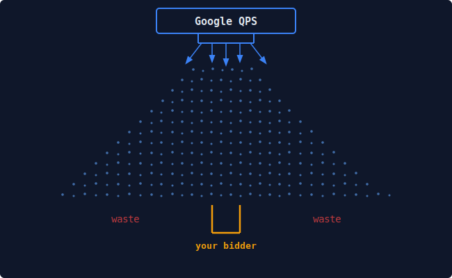

# RTBcat Platform – Notes for RTB Developers

This app optimizes QPS for Google Authorized Buyers seats.
It exists because AB does not provide a Reporting API, so reporting has to be rebuilt from exports.

Blocking specific publishers is much simpler here than in the AB pretargeting UI.

It’s not a perfect app: we still depend on CSV imports because there is no other data source.

The practical goal is to reduce bidder bandwidth and improve efficiency.

DIAGRAM:

A common issue is ingesting ~50,000 QPS.
(Think of it like waterfall.)
About 30,000 of that QPS can be low‑value signal that your bidder ignores because the media buyer doesn’t want that inventory.

In Google Authorized Buyers platform you only get 10 pretargeting settings per seat, plus a broad geo bucket (EUS, WUS, EU, Asia).
This app is about using those 10 settings as effectively as possible.

Even with that limit, it’s still a better control surface than what most other SSPs provide.

## Features and user benefits

1) **Works with single‑seat or multi‑seat AB accounts**
   - You can scope analysis and actions per seat so decisions match how the buyer account is actually set up.

2) **History & rollback for pretargeting changes**
   - Every change is recorded and can be rolled back. Changes are staged before applying for safety.

3) **Language mismatch detection (BONUS)**
   - Catch localization errors like Spanish ads running in Arabic markets or AED pricing targeting India, using your own AI subscription to scan creatives.

4) **Publisher allow/deny editor (per config)**
   - You can block or allow individual publishers directly, without CSV uploads or the AB UI.

5) **Clear win‑rate and waste visibility**
   - The app shows where bids drop off in the funnel so you can target the biggest waste first.

6) **Creative size waste**
   - Google sends ~400 different *ad-sizes* to your bidder. This is fine for HTML creatives, but for fixed-size display ads this can be a huge drain on your effective QPS. You can see which sizes get traffic but have no matching creatives, and decide to leave or stop Google from sending it in the first place!

7) **Creative‑level diagnostics**
   - You can inspect individual creatives with targeting context to find assets that underperform or mismatch.

8) **App/publisher drill‑downs**
   - You can trace performance drops to specific apps or sites and act on them quickly.

9) **Fast UI on large datasets**
   - Precomputed summaries keep the dashboard responsive even when daily volume is large.

10) **Deduplicated imports**
   - Re‑processing Gmail reports won’t double‑count results, so metrics stay accurate.

11) **Operational traceability**
   - Refresh logs show what ran and when, so you can trust the numbers you are looking at.

## Intended users

- Media buyers, Google ADX campaign managers, RTB/AB engineers maintaining pipelines and metrics.
- Optimization engineers reducing wasted QPS.
- Teams managing pretargeting at scale who need safe rollbacks.

## Deployment notes

- Production serving is Postgres‑only
- CI builds images; VMs pull and restart.
- when installing only add the seat access JSON key ONLY AT THE END to prevent leaks or exposure

## ARCHITECTURE

This system exists to preserve truth from source to decision: each contract defines a non-negotiable rule that must hold at every stage from import to precompute to API output.  
When a contract fails, we treat it as a broken measurement path (not a UI issue), block release if needed, and fix the pipeline before trusting optimization decisions.
